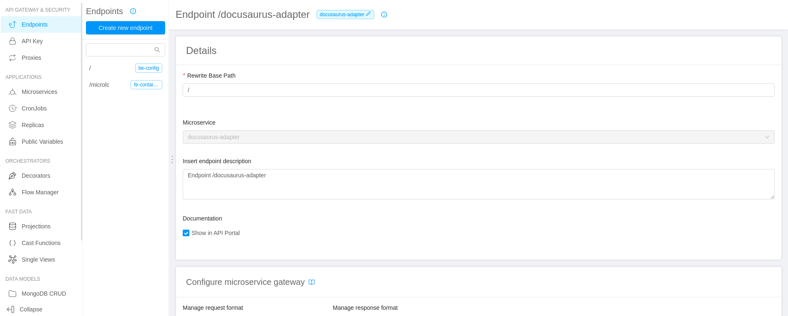

It is possible to integrate `micro-lc` inside the Mia-Platform Console with almost zero configurations.

## Integration requirements

Follow the requirements below to integrate this functionality:

- access to the Console into the desired project;
- the [authentication configuration](authentication.md) `JSON` and the [core configuration](core_configuration.md) `JSON` to expose.

## Integration steps

Following steps must be made on Console, and will deploy a `micro-lc` configured instance.

### 1. Microservice creation for `fe-container`
 
Here is the process to create an instance of `fe-container`.

1. Go to the `Microservices` section;
2. Create a new microservice using the `Microlc frontend` plugin (available in the `Microfrontend` section of the marketplace);
3. Configure the microservice with a custom name and description;
4. Complete the creation to deploy an instance of the `fe-container`.

### 2. Microservice creation for `be-config`

Here is the process to create an instance of `be-config`.

1. Go to the `Microservices` section;
2. Create a new microservice using the `Microlc backend` plugin (available in the `Microfrontend` section of the marketplace);
3. Configure the microservice with a custom name and description;
4. Complete the creation of the `be-container` instance;
5. In the `ConfigMap` section, edit the [`configuration.json`](core_configuration.md#example) and the [`authentication.json`](authentication.md#example),
   according to your needs
   
At the end of these 2 steps, the situation should be similar to the following:

### 3. Endpoint configuration for `fe-container`

1. Create a new endpoint;
2. Define the `Base path` where you want to expose `fe-container` (e.g. `/microlc`);
3. As type, use `Microservice`;
4. Select the microservice name used for `fe-container`;
5. Complete the creation.

After that, the situation should be similar to the following:

### 4. Endpoint configuration for `be-config`

1. Create a new endpoint;
2. As `Base path`, use `/api/v1/microlc`;
   :::caution
   The endpoints exposed by the `be-container` microservice must always be reachable at `/api/v1/microlc/...`:
   as in the microservice we defined the environment variable `SERVICE_PREFIX=/`, here `/api/v1/microlc` is enough.
   :::
3. As type, use `Microservice`;
4. Select the microservice name used for `be-container`;
5. Complete the creation.

:::caution
From the outside, the endpoints `/api/v1/microlc/configuration` and `/api/v1/microlc/authentication` exposed by this microservice must be always reachable.

So, if you set `/` as `Base path`, the `SERVICE_PREFIX` environment variable must be set to `/api/v1/microlc`.  
While, if you set `/api` as `Base path`, the `SERVICE_PREFIX` environment variable must be set to `/v1/microlc`;  
and so on...
:::

After that, the situation should be similar to the following:

## Result

At the end of this, you should have a complete instance of `micro-lc` up and running, 
exposed at the `Base path` provided for the [fe-container](setup.md#3-endpoint-configuration-for-fe-container)
(e.g. `https://your-host.com/microlc`). 

